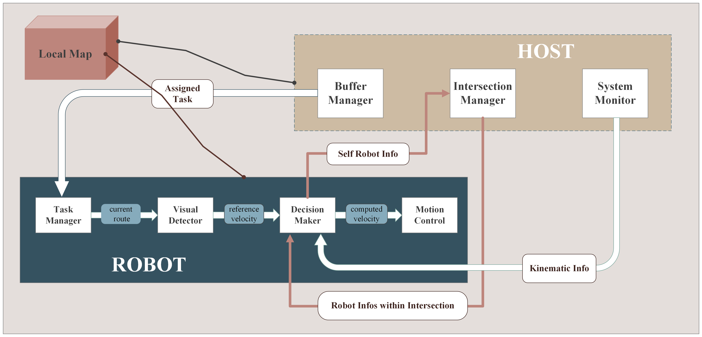

# SNAM ROBOT
ROBOT CODE REPO

For student research at TU Dresden - "Validating Virtual Spring Control for Compact, Low-Traffic Unsignalized Intersections: A Miniature Approach"

# Abstract
This project explores a distributed control approach for Autonomous Intersection Management (AIM) in small, single-lane intersections without traffic signals. Using ROS and Python, we implemented and tested a virtual spring-based coordination strategy on a scaled-down hardware platform. Compared to a simple grid-based baseline, our method significantly reduced the average vehicle travel time under low-traffic conditions.

本项目研究在无红绿灯条件下，小型单车道交叉口的分布式控制方法。基于 ROS 和 Python，我们在微缩硬件平台上实现并验证了基于虚拟弹簧的协同策略。与简单的网格控制方案相比，该方法在低交通密度下显著降低了车辆的平均通行时间。

# Code Structure
Host Code Repo: https://github.com/JiHaoyu1997/snam_host

# Local Map

# DEMO
[Demo (Bilibili）](https://www.bilibili.com/video/BVxxxxxxxxx)

# Control Gain

## scenario 1
Coontroller Gain = [-8.6669265,  13.92890099]

## scenario 2
Coontroller Gain = [-14.00904388  23.55785533]
